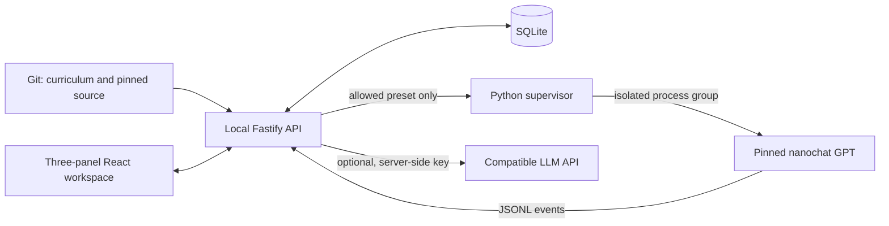

# Architecture

## Boundaries

v0.2 adds authored `LearningStep.diagram` anchors and optional `ExperimentResult.trace` version 1 (six sampled positions, eight-dimensional slices, five candidates per batch). Legacy results remain valid. Assessments explicitly select B=2/T=8 evidence; explanation text is optional. Curriculum version 1.0.0 and previous learning records remain intact.

The single learning container runs API and Python together. `LLM_CONTAINER=1` allows internal `0.0.0.0`; Compose publishes host loopback only. `LLM_RUNNER_PYTHON=/opt/runner/bin/python` selects the locked image environment. No Docker socket or network executor is introduced. Compose Watch uses a separate development volume. See [DOCKER.md](DOCKER.md).

Use `pnpm data backup/export/import` with SQLite's backup API. Import requires a stopped target and preserves its previous database. UI location is remembered locally; learning facts remain in SQLite.

- `apps/web`: React 19/Vite 8 SPA, React Router location state, TanStack Query requests, Zustand UI preferences, shadcn-style Radix primitives, Tailwind 4, Shiki, KaTeX, React Flow/Dagre.
- `apps/api`: loopback-only Fastify service. Validates content at boot; serves API and production frontend. SQLite through Drizzle/better-sqlite3 stores learner facts.
- `packages/contracts`: Zod runtime validation and shared TypeScript types. Client-supplied status/commands are never authoritative.
- `runner`: Python 3.12 supervisor and fixed experiment. Windows invokes WSL Ubuntu; Linux invokes Python directly. Protocol is JSONL over child stdio, not an exposed HTTP executor.
- `content`: canonical, versioned curriculum. Obsidian opens this directory directly.
- `data/upstream`: unmodified MIT source snapshots, full commit/parent metadata, file hashes, and GitHub's actual commit patches.

## Main data flow

The graph is an authored teaching graph. `calls` requires a source reference. It is not an automatically extracted or runtime-complete call graph. Source and guide views share a code reference; reference and step IDs live in URL query parameters.

## Persistence

Schema version 1 contains experiment runs/events, progress, assessment attempts and Tutor messages. Database migrations are applied transactionally before serving requests. The default database is `.local/data/learning.db`, ignored by Git. Completed records survive restarts; queued/running records become interrupted. Use the SQLite backup command for consistent live snapshots.

UI preferences may use localStorage. Learning facts must be written to the API. Objective verification requires a successful run from the same lesson version and a correct answer. Open explanations remain explicitly unreviewed.

## Execution

`pnpm experiment:setup` creates a managed Python environment under `~/.local/share/llm-zero-to-one/venv` within Linux/WSL, separate from the repository and system Python. The pinned dependency lock distinguishes CPU and CUDA extras. Experiment start never installs anything.

Runner verifies all snapshot hashes before importing the actual GPT class. The first experiment needs only the imported source modules and PyTorch/filelock, not datasets or checkpoints. Optional FA3 kernels are absent, so the upstream SDPA fallback is used. Model source is not patched. Future full training must add separate reviewed presets and dependencies.

One job runs at a time. The Python supervisor starts the experiment in a new process group and terminates it on cancel, stdin EOF, or shutdown. Node owns the queue and deadline. Database status is only successful after valid output and a successful subprocess exit.

## Local API

GET `/api/catalog`, `/api/source?file=...`, `/api/progress`, `/api/environment`, `/api/runs`, `/api/runs/:id`, `/api/runs/:id/events`, `/api/tutor/messages`.

POST `/api/progress`, `/api/assessments`, `/api/runs`, `/api/runs/:id/cancel`, `/api/tutor`.

Writes require a per-process local session token from `/api/session`; requests with foreign browser origins or hostnames are rejected. Native binding is loopback; containers bind internally with host-loopback publication. This is a single-user local service, not an authenticated multi-user deployment.

## Tutor

Tutor uses streaming Chat Completions-compatible HTTP configured through server environment variables. It receives current validated context and bounded same-step history. Provider failures are reported without exposing credentials. Citation checking validates allowed IDs, not semantic truth; generated answers remain AI explanations.

## Testing and release

Vitest covers content, persistence, APIs, and process lifecycle. Playwright verifies real UI interactions. pytest and the verification CLI execute the real pinned model. CPU runs in CI; GPU evidence is collected on the target machine. Release Please manages a single product version and release PR; release assets are produced in that same workflow.
